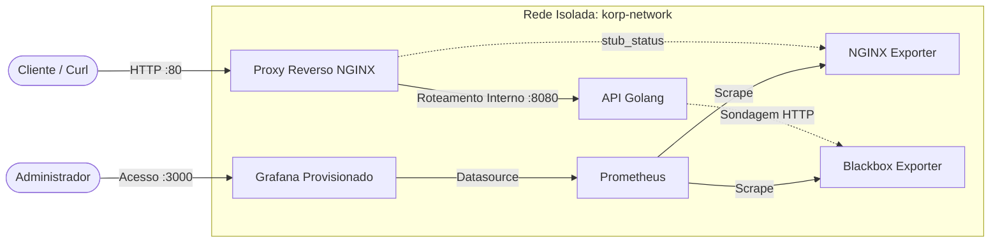

# Projeto Korp - Desafio de Infraestrutura e Observabilidade

Este repositório contém a solução completa para o **Desafio Técnico Korp**.

O projeto consiste em uma API HTTP desenvolvida em **Golang**, orquestrada via **Docker**, protegida por um **proxy reverso NGINX**, com uma stack de monitoramento automatizada (**Prometheus + Grafana**) e provisionamento via **Ansible**.

---

# Tecnologias Utilizadas

| Categoria | Tecnologia |
|-----------|------------|
| Linguagem | Go (Golang) 1.22 |
| Proxy Reverso | NGINX |
| Containerização | Docker & Docker Compose |
| Observabilidade | Prometheus, Grafana, NGINX Exporter, Blackbox Exporter |
| Automação (IaC) | Ansible |

---

# Arquitetura e Decisões Técnicas

O ambiente foi desenhado focando em **isolamento**, **segurança** e **facilidade de deploy**.



---

## Decisões de Design

### Separação de Responsabilidades

A aplicação Go **não possui bibliotecas de métricas acopladas ao código**.

Foi adotada uma estratégia de **monitoramento Black-box**, utilizando:

- **Blackbox Exporter** para validar continuamente a disponibilidade da API.
- **NGINX Exporter** para coletar métricas de tráfego e status do proxy reverso.

Essa abordagem mantém a aplicação desacoplada da camada de observabilidade.

---

### Segurança de Rede

O serviço principal (`http-server-projeto-korp`) executa apenas na rede interna:

```
korp-network
```

Não há exposição direta de portas da aplicação para o host.

Todo o tráfego externo passa obrigatoriamente pelo **NGINX**, responsável pelo proxy reverso na porta **80**.

---

### Provisionamento Automático (Configuration as Code)

O Grafana foi totalmente configurado utilizando arquivos YAML.

Durante a inicialização são provisionados automaticamente:

- Datasource Prometheus;
- Dashboard do projeto.

Assim, nenhuma configuração manual via interface Web é necessária.

---

# Pré-requisitos

Para executar o projeto utilizando a automação, é necessário apenas:

- Ambiente Linux;
- Ansible instalado localmente;
- Usuário com privilégios administrativos (sudo).

---

# Como Executar (Provisionamento IaC)

Toda a infraestrutura foi automatizada através de um único **Playbook do Ansible**, responsável por:

- instalar dependências;
- criar a rede Docker;
- construir as imagens;
- iniciar todos os containers.

A automação foi desenvolvida visando **idempotência**, permitindo múltiplas execuções sem efeitos colaterais.

## 1. Clone o repositório

```bash
git clone <URL_DO_SEU_REPOSITORIO>
cd http-server-projeto-korp
```

## 2. Execute o Playbook

```bash
ansible-playbook -i inventory.ini playbook.yml -K
```

> **Nota:** Ao final da execução, o playbook realiza automaticamente uma requisição HTTP para validar que a API foi iniciada corretamente e está respondendo.

---

# Validação e Acesso aos Serviços

## 1. API do Projeto Korp

A aplicação responde através do proxy reverso NGINX.

### Teste

```bash
curl http://localhost/projeto-korp
```

### Retorno esperado

```json
{
  "nome": "Projeto Korp",
  "horario": "2026-07-08T18:59:17Z"
}
```

---

## 2. Monitoramento e Observabilidade (Grafana)

O dashboard é provisionado automaticamente durante o deploy.

### Endereço

```
http://localhost:3000
```

### Credenciais

| Campo | Valor |
|--------|-------|
| Usuário | admin |
| Senha | admin |

Após acessar o Grafana, navegue em:

```
Dashboards
    └── Projeto Korp - Monitoramento
```

para visualizar as métricas de disponibilidade e tráfego.

---

# Estrutura de Diretórios

```text
.
├── app/                  # Código-fonte da aplicação Golang e Dockerfile
├── nginx/                # Configurações do Proxy Reverso (NGINX)
├── o11y/                 # Stack de Observabilidade (Prometheus + Grafana)
├── docker-compose.yaml   # Orquestração dos containers
├── inventory.ini         # Inventário do Ansible
├── playbook.yml          # Automação da infraestrutura
└── README.md             # Documentação técnica
```

---

Autor: **Ícaro Torres Mendes**